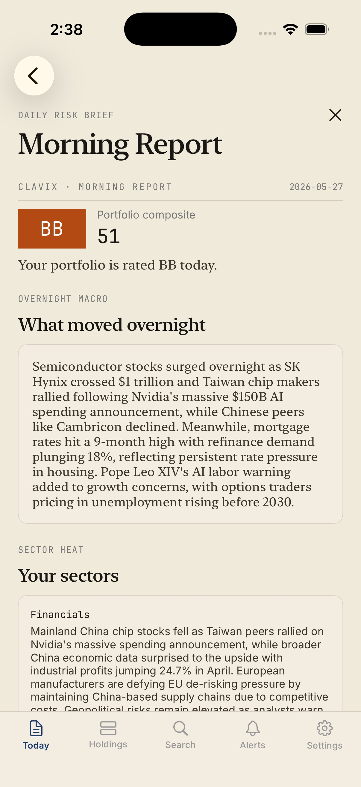

# Clavix

Clavix is an iOS portfolio-risk briefing for self-directed investors. It connects a user's holdings to relevant reporting, scores downside risk, and turns overnight changes into one reviewable morning digest.

[Product website](https://getclavix.com) · [Portfolio case study](https://sansarkarki.com/case-study/meridian-health/)



## What it does

- Builds a holding-aware morning report instead of another general market feed.
- Scores five risk dimensions while keeping the evidence visible.
- Supports stock search, watchlists, alerts, and portfolio-level risk summaries.
- Runs scheduled analysis and notification jobs from a FastAPI backend.

## Architecture

| Area | Technology |
| --- | --- |
| iOS app | SwiftUI, StoreKit 2, XcodeGen |
| API and jobs | FastAPI, Python, PostgreSQL |
| Data and auth | Supabase |
| Infrastructure | Docker, Cloudflare Tunnel, VPS |

The main implementation lives in `ios/Clavis/` and `backend/app/`. Database migrations live in `supabase/migrations/`; architecture and operating notes live in `docs/`.

## Local development

```bash
cp backend/.env.example backend/.env
docker compose up --build
```

Generate the iOS project from `ios/project.yml` with XcodeGen, then open it in Xcode. Production credentials, portfolio data, generated analysis runs, and local tunnel configuration are intentionally excluded from this repository.

## Tests

```bash
docker compose run --rm backend pytest
```

Clavix provides informational risk analysis, not investment advice.
